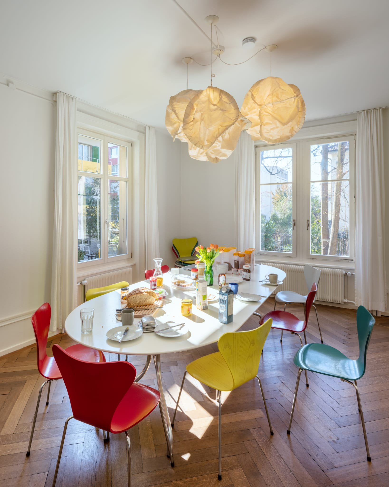
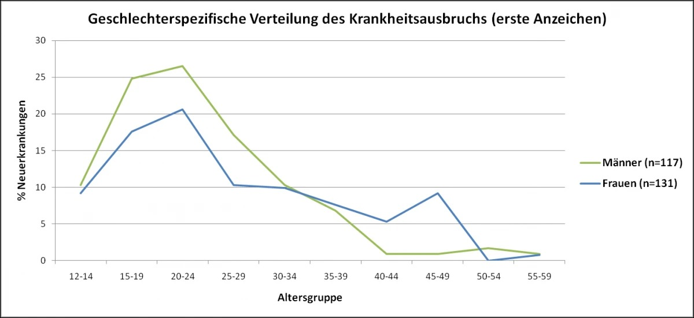
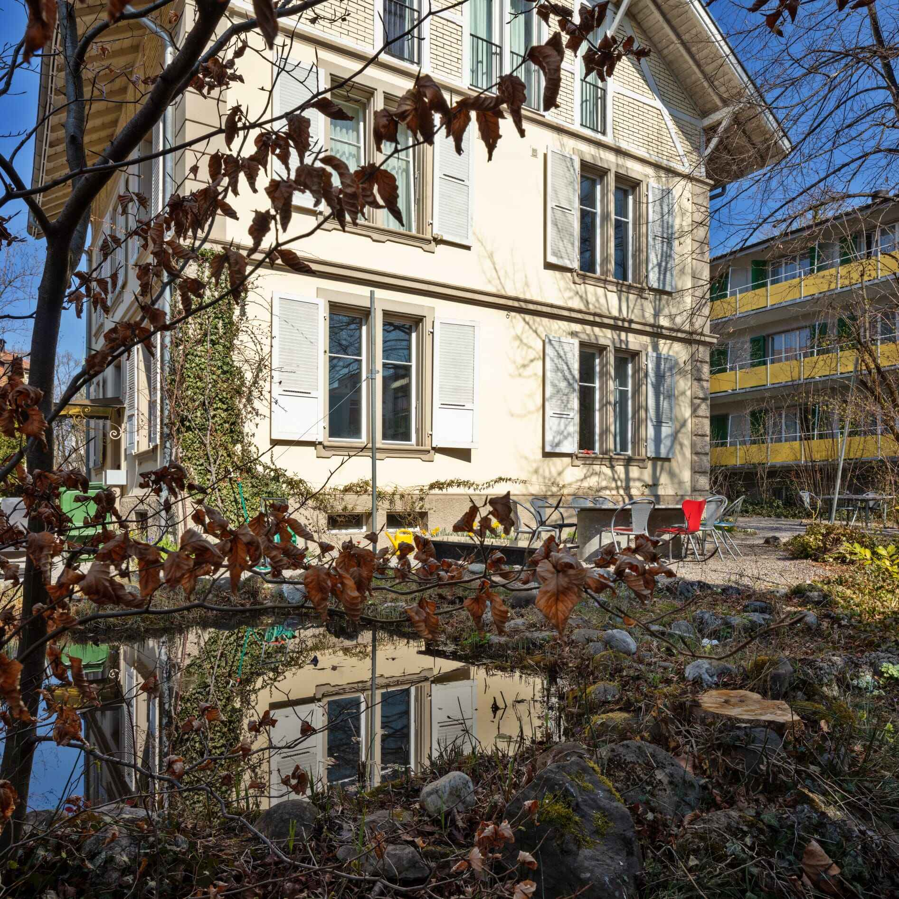

+++
title = "Die unsichtbare Last: Schizophrenie im Jugendalter"
date = "2024-06-05"
draft = false
pinned = false
tags = ["Deutsch", "Reportage"]
image = "titelbild.webp"
footnotes = " *Um die Privatsphäre des Interviewpartners Luca Fischer zu schützen, wird sein Name in dieser Reportage anonymisiert bleiben.*\n\n***Quellen:***\\\nEnableMe: Schizophrenie: [Dinge sehen, die nicht da sind ](https://www.enableme.ch/de/behinderungen/schizophrenie-6450)(abgerufen am 6.5.2024)\n\nDie Techniker: [Was ist Schizophrenie?](https://www.tk.de/techniker/gesundheit-und-medizin/behandlungen-und-medizin/psychische-gesundheit/weitere-psychische-erkrankungen/was-ist-schizophrenie-2017900?tkcm=aaus) (zuletzt abgerufen am 6.5.2024)\n\nReasearchGate: [Milieutherapie und Ansätze aus der Soteria – Wie gestalte ich das Umfeld therapeutisch?](https://www.researchgate.net/publication/332297450*Milieutherapie_und_Ansatze_aus_der_Soteria*-_Wie_gestalte_ich_das_Umfeld_therapeutisch) (zuletzt abgerufen am 6.5.2024)\n\nTheodor Wenzel Werk E.V.: [Schizophrenie: Anzeichen, Ausprägungen, Therapie](https://tww-berlin.de/kliniken/krankheitsbilder/schizophrenie/) (zuletzt abgerufen am 7.5.2024)\n\nStudysmarter: [Schizophrenie Symptome](https://www.studysmarter.de/schule/biologie/verhaltensbiologie/schizophrenie-symptome/) (zuletzt abgerufen am 6.5.2024)\n\nUPD Universitäre Psychiatrische Dienste Bern: [Zentrum für Schizophrenie und Psychose](https://www.upd.ch/de/angebot/erwachsenenpsychiatrie/zentrum-schizophrenie-und-psychose.php) (zuletzt abgerufen am 5.5.2024)\n\nYoutube: [24. Schizophrenie](https://youtu.be/nEnklxGAmak?si=En-CByyPsgd0QfOt) (zuletzt abgerufen am 12.3.2024)\n\nStudysmarter.de:[ Schizophrenie Symptome, 2024](https://www.studysmarter.de/schule/biologie/verhaltensbiologie/schizophrenie-symptome/) (abgerufen am 6.5.2024)\n\nigsbern: [Stationäres Angebot](https://www.igsbern.ch/de/soteria/stationaeres-angebot-3.html) (abgerufen am 6.5.2024)"
+++
** In einer Welt, die von scheinbarer Normalität geprägt ist, kämpfen viele junge Menschen hinter den Kulissen mit dieser komplexen psychischen Störung. Doch was bedeutet es wirklich, mit Schizophrenie im Jugendalter zu leben? Und wie können wir als Gesellschaft dazu beitragen, diese Last zu lindern und jungen Betroffenen ein unterstützendes Umfeld zu bieten?** 

Tsering Tschango, Narin Kamil Saih

>
> *«Du bist eine von acht Personen, die auserwählt sind. Ihr alle habt besondere Fähigkeiten, weshalb wir in der Arktis einige Tests mit euch durchführen werden».* 

Luca Fischer schüttelt den Kopf. Schon wieder diese Stimmen. Er hasste es, wenn ihm immer «abnormale» und unangenehme Stimmen von einem normalen Alltag abhielten. Was glauben wohl die Leute in seinem Umfeld nur, wenn er etwas vor sich hinmurmeln muss? 
    Mit einem leisen, unbestimmten Flüstern, das sich langsam in das Leben eines Jugendlichen schleicht, beginnt es. Anfangs kaum mehr als ein Schatten im peripheren Blickfeld, wuchsen Lucas Symptome mit der Zeit zu unüberhörbaren Stimmen heran. 
    Luca Fischer lebt seit seiner Kindheit mit visuellen Halluzinationen. Im frühen Jugendalter zwischen 12 und 13 Jahren schlossen sich akustische Einbildungen als weiteres Symptom an. Das Science-Fiction Buch “Maze Runner“ war der endgültige Auslöser dafür. 
    Luca Fischer, der seit seiner Kindheit mit diesem Spektrum von Symptomen lebt, führt uns durch die Herausforderungen, denen er sich tagtäglich seit dem Jugendalter stellen muss. 

#### Entwirrung der Schizophrenie

Die Schizophrenie ist eine psychische Krankheit, welche die Denkfähigkeit und die Wahrnehmung der Welt des Erkrankten stört. \
    Die Schizophrenie mit ihrem Spektrum an Symptomen passt in keine Schublade. Sie wird zwar in drei Subtypen geordnet, welche aber oft im Laufe der Krankheit miteinander verschmelzen. Diese Subtypen sind die paranoide  Schizophrenie, die katatonische Schizophrenie und die hebephrene Schizophrenie. 
    Wo die katatone Schizophrenie einen stundenlangen Starrezustand und Mutismus verursacht, lässt die hebephrene Schizophrenie die Äusserungen des Betroffenen nicht mehr nachvollziehbar wirken. Sie ist eine Ausprägung der paranoiden Schizophrenie, welche die klassische Symptomatik aufweist. Betroffene wirken distanzlos und in ihrer eigenen Welt versunken, passend in das typische Krankheitsbild der Schizophrenie. 
    Daniel Eichert, ein Quereinsteiger in der Soteria Bern, ein kleines psychiatrisches Akutspital, definierte: „Wenn Episoden oder psychotische Krisen wiederholt erlebt werden, kann man von der Schizophrenie sprechen.“

### Die Symptomatik im Blick

> *“Grundsätzlich lässt sich sagen, dass das Krankheitsbild der Schizophrenie ein Verschwimmen der Grenzen ist, ob die eigenen oder die der anderen.“* 

Dies erläuterte uns Herr Eichert. Er arbeitet täglich mit Betroffenen und ermöglicht ihnen mithilfe der Konfrontationstherapie und der Milieutherapie, welche auf einen Wechsel im Umfeld der Betroffenen ruht,  einen neuen Einstieg in die Realität und ihr Leben. 
In einem Interview hat er uns viele ungenannte Symptome aufgezeigt. \

“\[Das ist] oftmals das Gefühl, dass das Ich-Bewusstsein nicht vorhanden ist. Man löst sich quasi auf.“, erklärt er. Dies sei auf eine Reizüberflutung zurückzuführen, welche persönliche Beziehungsideen verursache. Das Ich-Bewusstsein könne keine Reize mehr verarbeiten. Das menschliche Gehirn versuche nichtsdestotrotz, logische Verbindungen zu knüpfen, welches eine pathologische Realitätswahrnehmung verursache.
     Beziehungsideen würden zusätzliche Symptome und Zustände verursachen, die den Betroffenen in eine psychotische Episode führen. Wenn diese Auslöser nicht identifiziert und gemieden werden, gerät man wiederholt in diesen psychotischen Zustand. Ab dann wird von einer Schizophrenie gesprochen und die Patienten werden in eine Klinik wie die Soteria weitergeleitet, in welcher den Betroffenen beigebracht wird, die Auslöser zu vermeiden und, wenn möglich, ohne Medikamente mit ihnen umzugehen. 

Sogenannte “Trigger“ können eine Vielfalt von Symptomen auslösen. Darunter liegen Wahnvorstellungen mit abnormalen Assoziationen, unangemessene Reaktionen und ein Verlust der Fähigkeit, Realität von Fantasie zu unterscheiden. 
    Betroffene können viele Arten einer Wahnvorstellung erleben, wie den Verfolgungswahn, Vergiftungswahn, hypochondrischer Wahn (eine beharrliche Sorge um die eigene Gesundheit) oder ein Grössenwahn, in welcher sich der Betroffene zu einer grossen Aufgabe berufen fühlt.
    Ein weiteres klassisches Symptom sind Halluzinationen. Halluzinationen sind Wahrnehmungsstörungen, welche sich häufig in Form von imperativen Stimmen, Gedankenlautwerden, dialogischen und kommentierenden 	Stimmen wahrnehmen lassen. 
    Einbildungen führen zu fiktiven Gesprächen mit nichtexistierenden Personen und Halluzinationen von Stimmen, gefolgt von einem sozialen Rückzug. 



##### Die Geschwister der Schizophrenie

Eine Schizophrenie professionell zu erkennen kann ziemlich herausfordernd sein aufgrund ihrer vielfältigen Erscheinungsformen. Oft ist eine Verwechslung mit einer anderen psychischen Störung der Fall. Sie teilen sich psychotische Symptome oder ähneln sich charakteristisch im Krankheitsverlauf. Mögliche Verwechslungen herrschen mit: der Dissoziativen Identitätsstörung (DIS), der Demenz oder dem Autismus.

Die DIS ist eine psychische Störung, bei der zwei oder mehrere Identitäten die Kontrolle innerhalb einer Person übernehmen. Das Wort «Schizophrenie» aus dem Griechischen bedeutet «gespaltener Geist oder Bewusstsein». Dies wird fälschlicherweise für eine gespaltene Persönlichkeit gehalten. 
Ein merklicher Unterschied liegt darin, dass sich durch eine Schizophrenie nicht der Charakter eines Menschen verändert, sondern seine Wahrnehmung und Verhalten.



### Das persönliche Akutspital der Soteria

Ein verwilderter Garten mit einem Teich vor dem kleinen Wohnhaus mit der altmodischen Haustür. Auf den Gedanken, dass dies ein psychiatrisches Akutspital ist, wären Beiläufer wahrscheinlich nicht gekommen. Doch tatsächlich richtet sich die Behandlung in erster Linie an junge Menschen, die sich in einer akuten schizophrener oder adoleszenten Krise befinden. 
     Die Soteria ist nicht allzu bekannt in Bern weshalb der stellvertretende Leiter und Schizophrenie-Experte Daniel Eichert leicht überrascht war von einer Gesprächsanfrage über die Therapie an der Soteria. 
“Ich bin kein Arzt, unsere Ärzte stellen Diagnosen“ versichert Daniel Eichert. Die ausgewiesenen Ärzte diagnostizieren die Patienten während der Behandlung. Danach wird die medikamentöse Therapie verabreicht unter Absprache mit Ärzten und Betreuer. 
     Eine Milieutherapie wird ebenfalls angeboten, die die psychiatrische Behandlung schwerer Erkrankungen individuell an die Symptomatik und Situation angepasst. Sogenannte Milieufaktoren würden gezielt beeinflusst durch Strukturierung des Tagesablaufes, Interaktion zwischen Patienten, Behandlern und Angehörigen um den gemeinsamen therapeutischen Prozess zu ermöglichen und fördern. Alle Patienten erhälten eine persönliche Behandlung je nachdem, in welchem akuten Zustande sie seien. Bei jemandem in akuteren Zustand achte man darauf, denjenigen nicht einer stärkeren Alltagsbewältigung auszusetzen und dass die medikamentöse Dosierung etwas höher sei, berichtet Daniel Eichert.
Zur Abschwächung der akuten Phase stellt man den Bewohnern kleine alltägliche Herausforderungen, wie das Kochen, gemeinsame Gruppenprogramme oder an der Tagesplanung teilnehmen. 
     Durch behutsame Milieutherapie, einer entspannten Atmosphäre und progressive Zusammenarbeit erhofft man sich in der Soteria Fortschritte für jeden Patienten, sodass sie schlussendlich sicher auf eigenen Füssen stehen. 

### Ursachen der Schizophrenie

Das Gebiet der Schizophrenie ist noch lange nicht gänzlich erforscht und einiges ist noch unbekannt. Viele Psychologen oder Ärzte beziehen sich auf ein psychosoziales Modell, darunter auch 	Daniel Eichert. Das Modell sagt aus, dass im Zusammenhang mit mehreren Faktoren, die unter gemeinsamen Zusammenspiel eine erhöhte Möglichkeit einer schizophrenen Reaktion auslösen können. Laut Daniel Eichert können Symptome auf eine genetische Vererbung als biologische Faktoren, Stress und traumatische negative Erlebnisse die als Psychosoziale Faktoren bezeichnet werden oder Drogenkonsum, vor Allem Cannabiskonsum, zurückführen.                                                    Jedoch ist die Ursache der Entstehung einer Schizophrenie nicht immer bekannt. 
    Wenn ein Elternteil schon eine psychische Erkrankung hat, ist eine mögliche Erkrankung des Kindes grösser als bei einem nichtbetroffenen Familienstamm. Bei etwa zwölf von hundert Kindern deren Eltern an Schizophrenie betroffen sind, treten im späteren Alter tatsächlich Schizophrenie auf.

### Psychosoziale Faktoren

Die persönliche Lebensgeschichte und Erfahrungen sind alles potenzielle Ereignisse von Bedeutung, die zu einem Trauma führen können und damit eine prägende Rolle für die Entstehung einer Schizophrenie spielen. Daniel Eichert weist auf eine erhöhte «Verletzlichkeit» durch die kombinierten Faktoren aus. Er definiert den Begriff dadurch wie bestimmte traumatische Erlebnisse in der Vergangenheit eines Menschen als Faktoren zu einer grösseren «Verletzlichkeit» der Bildung von schizophrenen Symptomen führen können. Beobachtbar ist die erhöhte Verletzlichkeit in der Kindheit oder Jugendalter mit auffälligem Verhalten. Fachpersonen der Soteria schätzen die Verletzlichkeit und zusätzliche Stressfaktoren für das Auftreten psychotischer Krisen in etwa 1% der schizophrener Bevölkerung.

### Krankheitsablauf

Grundsätzlich wird die schizophrene Therapie in drei Säulen unterteilt. Eine medikamentöse Behandlung, eine Psychotherapie und aktive Teilnahme am Leben. 
     Die Medikamente dienen zur Gleichgewichtshaltung chemischer Botenstoffe im Gehirn. Die Behandlung zielt einmal auf die akute Phase, aber auch auf Langfristigkeit, um in Zukunft akute Schübe zu verhindern.
Bei einer	psychotherapeutischen Behandlung, welche die soziale Kompetenz trainiert, ist die Stabilisierung und Stärkung der betroffenen Person das Ziel.\
     Therapeuten und Betreuer helfen den Patienten ein möglichst selbstständiges Leben zu führen indem sie sie motivieren neue Kontakte zu knüpfen.

### Die Schizophrenie unter der Lupe – Ein Interview mit Luca Fischer

Für einen Einblick in das Leben einer jugendlichen Schizophrenie-betroffenen Person, führten wir ein Interview mit dem Teenager Luca Fischer, der uns genaueres erzählte, über seinen persönlichen Krankheitsverlauf. 
Lebendige Clownsgestalten, Erscheinungen von Menschen kleiner Grösse und Tiere in der Alltagsumgebung: Halluzinationen kennzeichnen und begleiten Schizophrene Menschen regelmässig in ihrem Leben. \
    "Das Buch "Maze Runner", das ich damals gelesen habe, beeinflusste und verstärkte meine Symptome stark.“ erzählt der Teenager.  Die Stimmen die Luca  hörte, unterschieden sich in ihrer Bedrohlichkeit. Tatsächlich konnten sie beunruhigender werden und den Träger zu eigenwilligen Handlungen anstiften. 
    Obwohl Luca’s Symptome sich in seinen früheren Jahren äusserten, wurden sie bei therapeutischen Besuchen vernachlässigt und nicht ernstgenommen. Man sah die Symptome als die des Autismus  gleich, eine Krankheit mit dem der Teenager im Voraus schon diagnostiziert wurde. Danach diagnostizierte man ihn mit der Borderlinestörung (BPD) statt Schizophrenie aufgrund ihrer ähnlichen Symptome. 
      Im Verlauf der Zeit verstärkten sich die Symptome und somit auch das Bewusstsein der Existenz der Schizophrenie. "Jetzt besuche ich eine neue Therapeutin, die mir bezüglich der Stimmen unterstützt ", erwähnt Luca Fischer und bestätigt: "In den nächsten Wochen werde ich ebenfalls Medikamente bekommen die Nebenwirkungen haben können."

### Herausforderungen

Die Therapie ist wohl-benötigt und den Jugendlichen im nicht-stressfreien Alltag behilflich gegen den täglichen Belastungen. Unvermittelte psychotische Episoden erschweren Situationen, die Mitmenschen problemlos 	durchstehen,aber komplizierter für schizophrene Menschen verlaufen. 
      Vor allem Schüler wie Luca Fischer, die längere Zeitspannen im Klassenzimmer verbringen, machen damit Erfahrung. Für ihn ist es eine Herausforderung, Normalität vorzutäuschen,	wenn gleichzeitig eine starke Präsenz der Stimmen vorherrscht. Eine Wortfindungsstörung ist Teilsymptom akustischer Einbildungen bei Luca Fischers Episoden. Er würde Aussagen fehlerhaft verstehen, als sie ursprünglich gemeint seien. Diese Ausgangslagen seien verunsichernd und unangenehm, berichtet der Jugendliche. 
Soziale Interaktionen mit Mitmenschen und in Gruppen bedeuten eine grössere Aufwand und die Integrierung in der Gesellschaft kann im Gesamten schwerfallen. Das Leben einer schizophrenen Person ist dadurch stärker eingeschränkt in existenzielle Bedürfnisse und Anforderungen – Eine geeignete Arbeitsstelle zu finden, sich anzufreunden, die Möglichkeit für eine/n Partner/In oder wünschenswerte Freizeitaktivitäten nachzugehen. 
      Luca Fischer weiss von seiner Erfahrung, dass er Medien und Filme mit übernatürlichen Elementen oder komplexen Themen vermeiden soll.

### Das Prisma des Mitgefühls

Die öffentliche Wahrnehmung der Schizophrenie ist oft von falschen Vorstellungen geprägt, die durch Medien und den alltäglichen Gebrauch stigmatisierender Begriffe verstärkt werden. Oft wird das Bild von Schizophrenie-Betroffenen als äußerst bedrohlich und als eine Gefahr für sich und die Umwelt inszeniert. Diese Vorurteile führen zu Diskriminierung und einer abweisenden Haltung gegenüber Betroffenen. 
“Ja, das Bild von Schizophrenie ist in der Öffentlichkeit sehr stark und falsch geprägt - durch Medien wie Filme, aber auch Bücher. Beleidigungen wie «Schizo» werden im Alltag oft scherzhaft verwendet, wie ihr sie wahrscheinlich auch schon gehört habt”, meint auch Luca Fischer.
Die Schizophrenie ist eine sehr vielseitige Krankheit mit Symptomen, die nicht zu Stereotypen reduziert werden können. Jugendliche Betroffene seien eingeschränkt in ihrem Alltagsleben und fühlen sich oft missverstanden durch die Stereotypen, sagt Luca. 
Die Jugendzeit von Schizophrenie-Erkrankten ist eine Zeit der Herausforderungen, aber auch der Hoffnung auf Verständnis und Unterstützung. Durch Aufklärung und Sensibilisierung können wir dazu beitragen, ein unterstützendes Umfeld für Betroffene zu schaffen und Vorurteile abzubauen 
     «Was wünschen Sie sich als betroffene Person von dieser Reportage?», fragten wir Herr Fischer. 
«Das möglichst viele Personen eure Reportage lesen und dies eine aufklärende Wirkung auf LeserInnen hat. Ich hoffe, dass sie ein neues Bild von Menschen betroffen mit Schizophrenie haben und keine negativen Vorurteile fällen.» antwortete er, hoffend auf einen Wechsel den ihm endlich erlaubte, seinen Zustand nicht mehr verbergen zu müssen. Denn jeder Mensch verdient es, mit Respekt und Verständnis behandelt zu werden. 

